# iRacer — As melhores ligas e corridas do jogo ofical da F1 na palma da sua mão!

|    Tela de Login     |     Lista de corridas      |      Resultados da Corrida       |      Criação de Corrida      |
| :------------------: | :------------------------: | :------------------------------: | :--------------------------: |
|  | 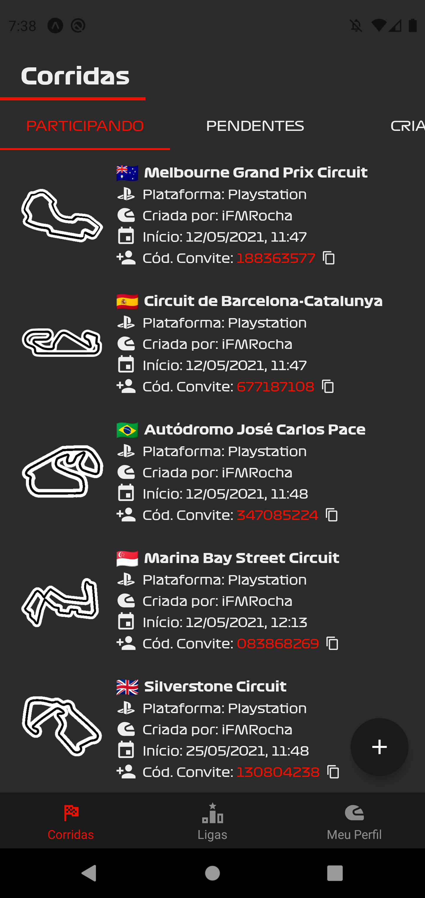 | 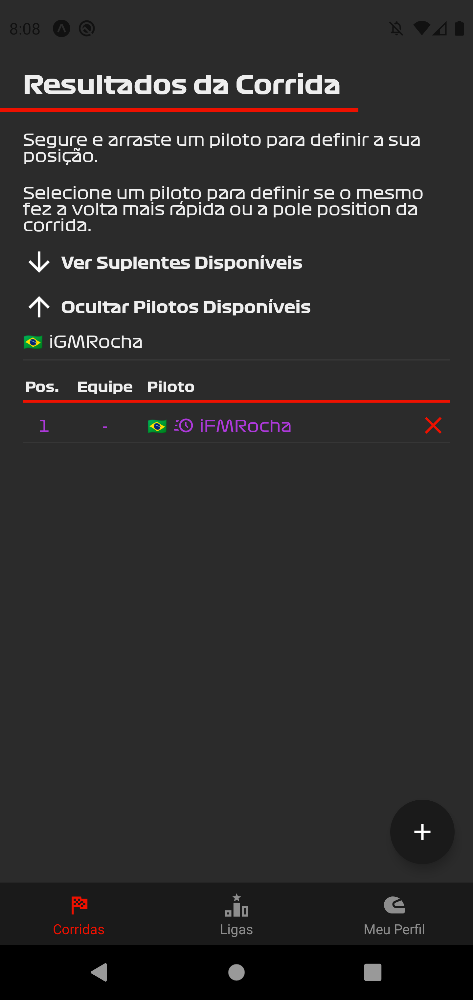 | 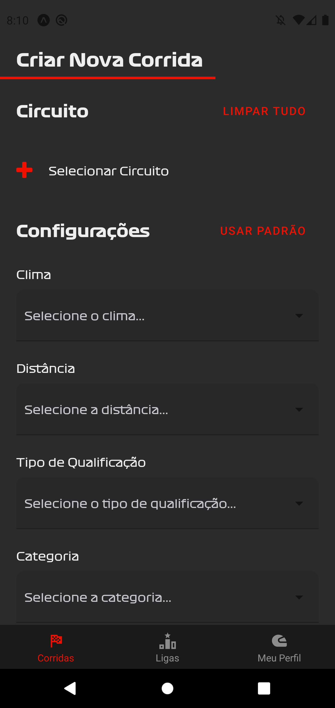 |

Olá, meu caro amigo(a)! Meu nome é Felipe Rocha, e você está presenciando o projeto mais ambicioso (e incrível haha!) que eu tenho atualmente — o iRacer.

Eu sou apaixonado por automobilismo, especialmente por F1, por videogames e, claro, por programação. Nele eu achei uma forma de unir essas três paixões em algo extraordinário.

## O que é o iRacer?

Antes de falar o que ele é, vou explicar pra você o problema que ele resolve. No jogo da F1, há campeonatos. Estes campeonatos são gerenciados por pessoas, que precisam, de corrida em corrida, guardar as suas informações (quem venceu, pódio, volta mais rápida etc), e elas geralmente fazem isso no Excel. Elas também precisam, após as corridas, atualizar a tabela geral da liga.

Este é um processo que é beeeem chato, e que desestimula as pessoas a criarem os seus próprios campeonatos, uma vez que elas precisam dedicar um bom tempo para atualizar os seus dados corretamente — e essa dificuldade aumenta exponencialmente com o número de participantes.

Maaas, para a felicidade de todos (rs) eu criei o iRacer. Ele calcula toda a tabela geral da liga automaticamente se baseando nos resultados das corridas, ou seja, ele tira uma camada de complexidade muito grande das costas do dono do campeonato — que é o gerenciamento e condensamento dos resultados das corridas. Além disso, ele guarda todas as estatísticas de cada piloto em seu próprio perfil. Por exemplo, se eu venci uma corrida e fiz a volta mais rápida, eu ganho +1 vitória e +1 volta mais rápida em meu perfil de piloto:

  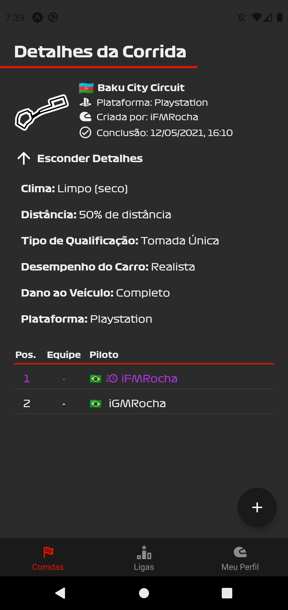
    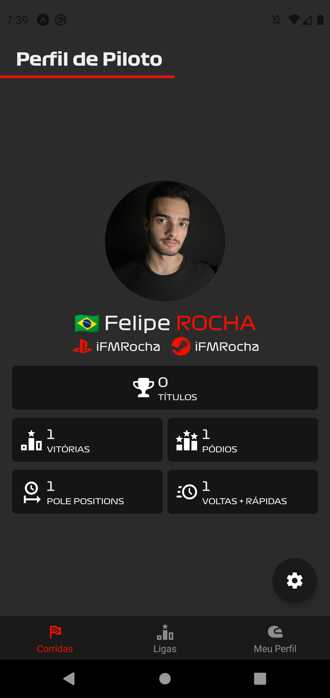

## Processo de Criação e Finalização de uma Corrida

O iRacer suporta tanto a criação de ligas, como mencionei anteriormente, quanto a de corridas isoladas. A primeira funcionalidade ainda está em desenvolvimento, mas logo deve ser concluída!

Portanto, vamos ver como funciona o processo de criação de uma corrida.

### Primeiro passo: Definição de circuito e configurações

    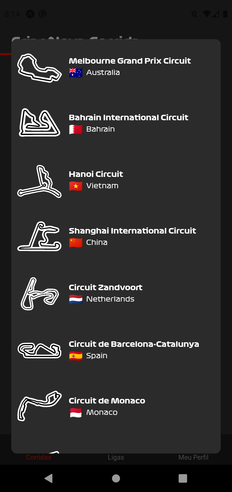
    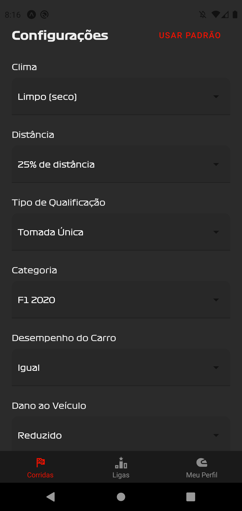
    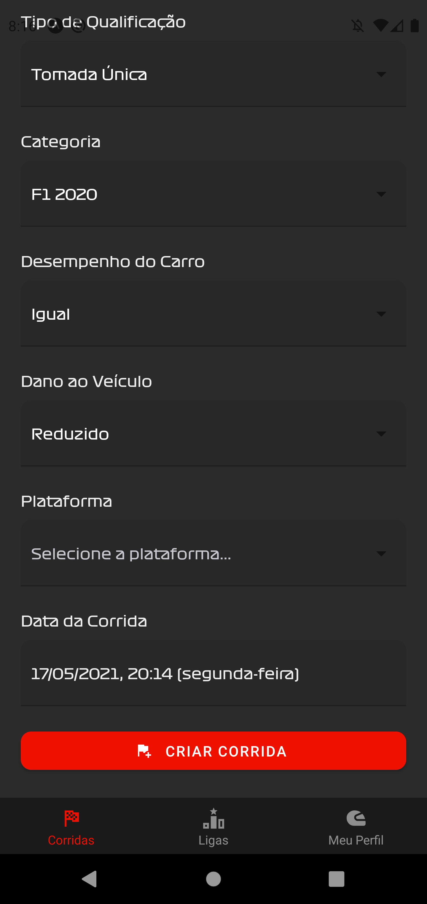
    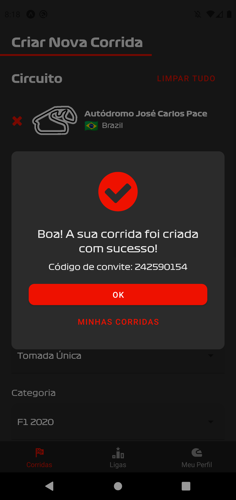

### Segundo passo: Entrada de participantes por meio do Código de Convite

    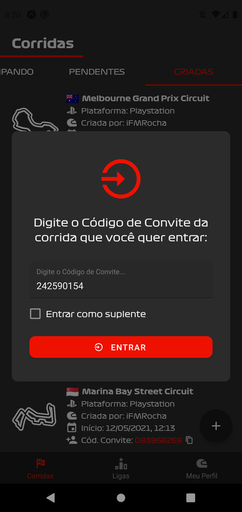
    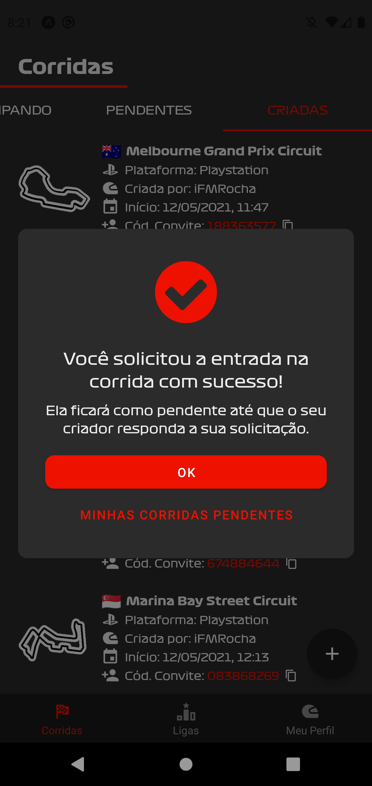

### Terceiro passo: Aprovação de pilotos pendentes

    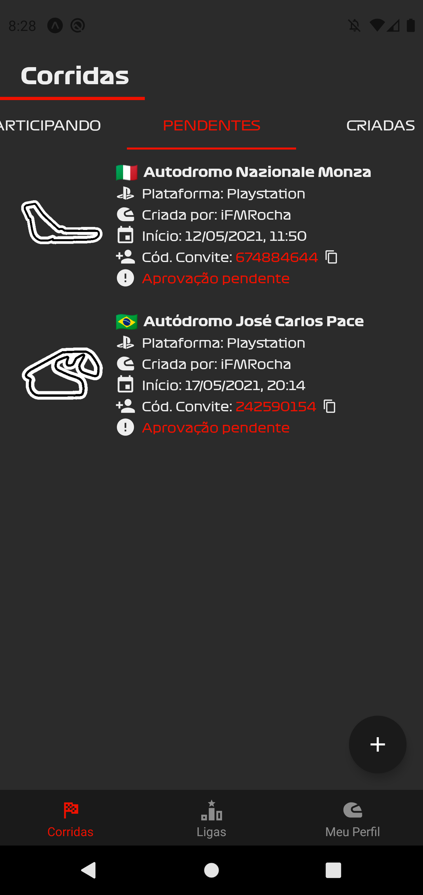
    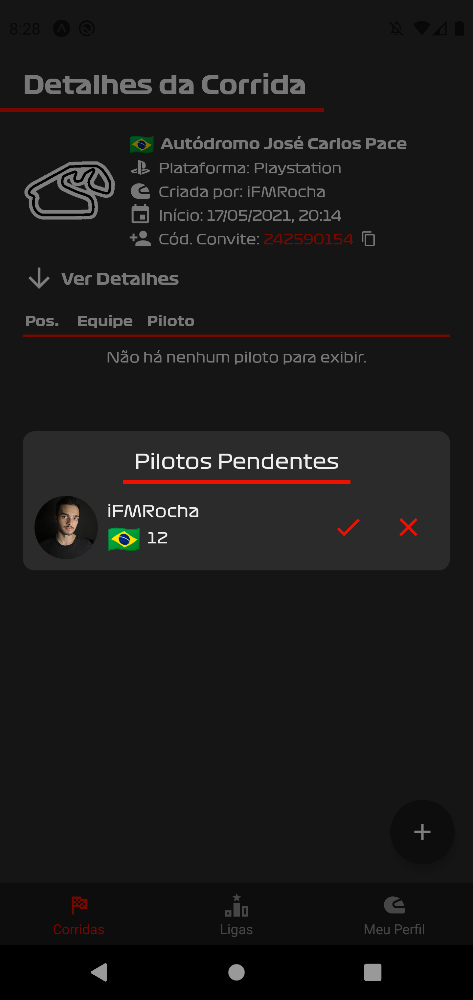
    

